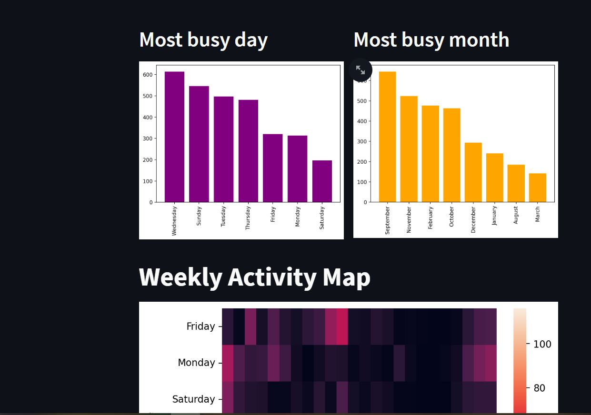
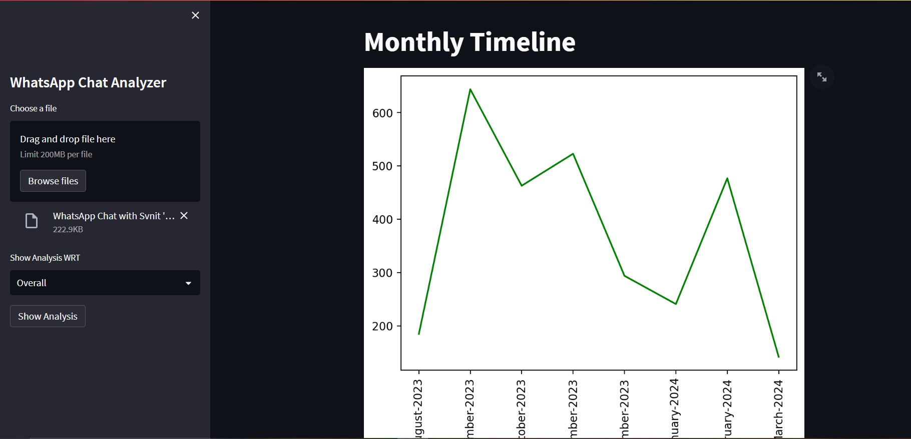
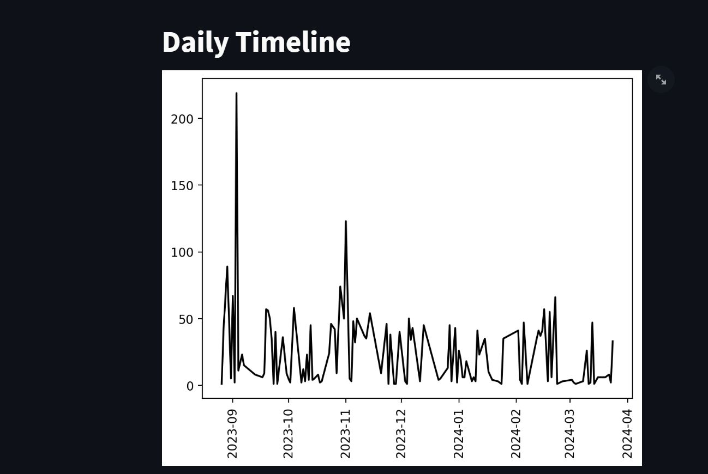
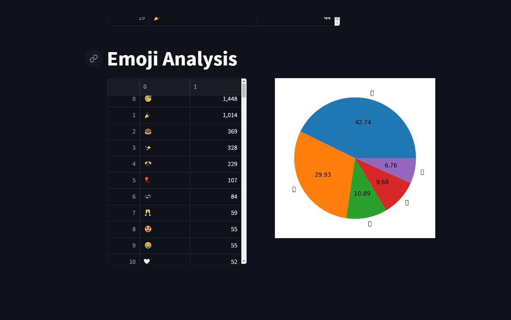

# WhatsApp Chat Analyzer

## Project Description

The WhatsApp Chat Analyzer is a Python tool designed to analyze and visualize WhatsApp chat data. This tool parses the exported text chat data from WhatsApp and provides insights into various aspects of the conversation, such as message frequency, most active users, word frequency, and more.

## Features

- **Message Frequency Analysis**: Analyze the frequency of messages over time to understand chat activity patterns.

- 
- **Most Active Users**: Identify the most active users in the chat based on the number of messages sent.
- **Word Frequency Analysis**: Analyze the most commonly used words in the chat to identify trending topics or common phrases.
- **Time-based Analysis**: Explore chat activity trends based on different time intervals (e.g., hourly, daily, weekly).
- 
- - 
- **Visualizations**: Visualize chat data using graphs and charts for easier interpretation.
- - 
